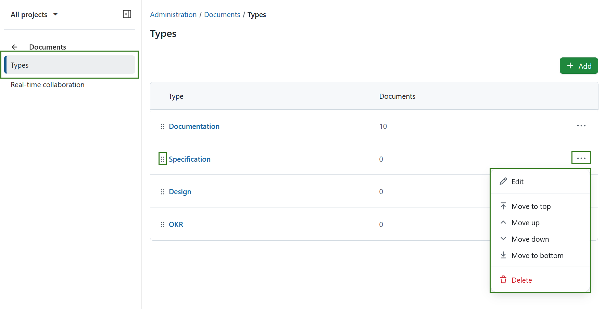
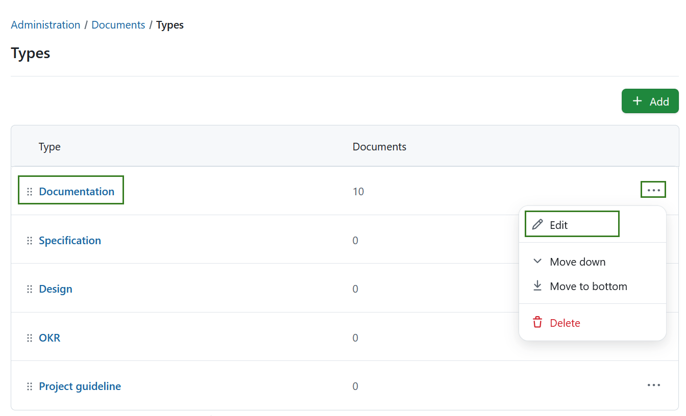
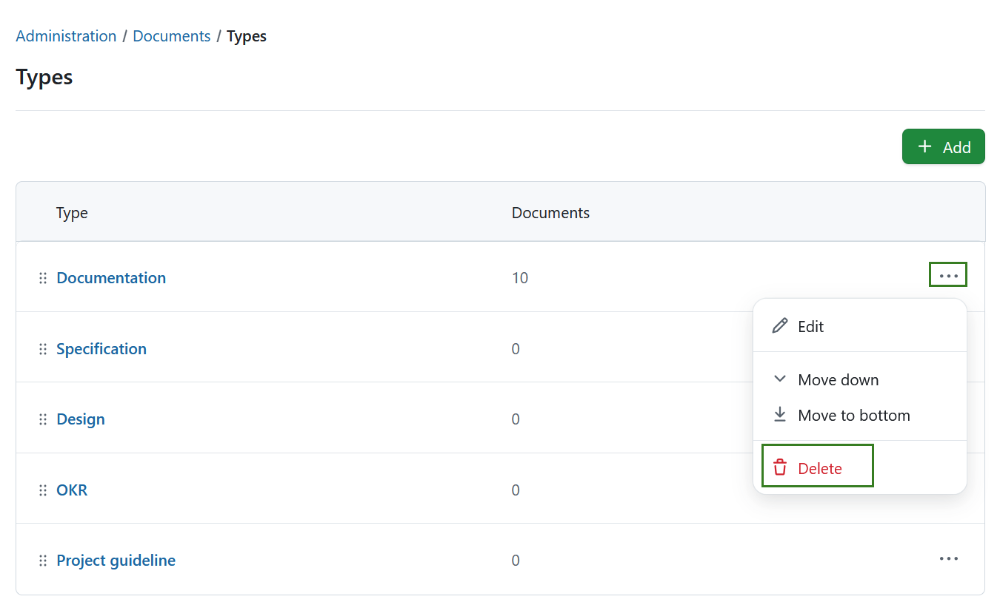
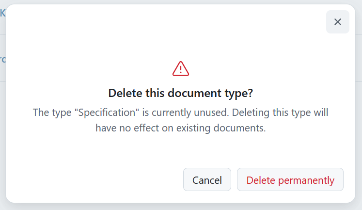
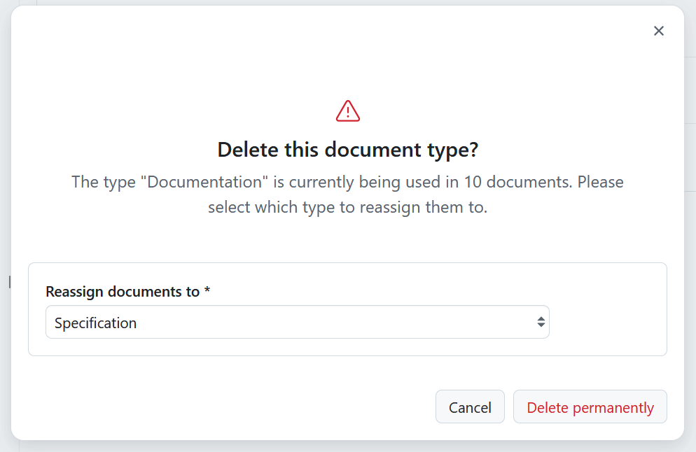
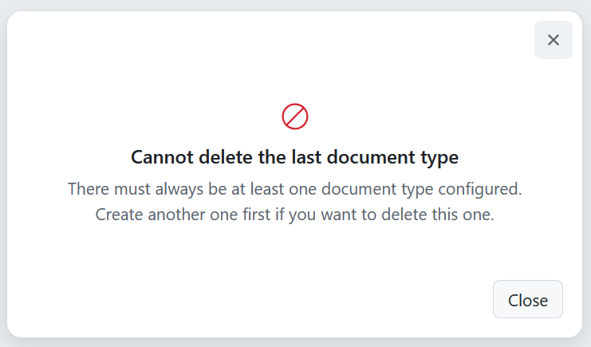
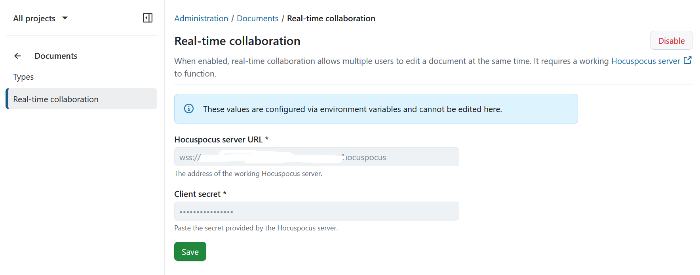

---
sidebar_navigation:
  title: Documents
  priority: 900
description: Documents module settings in OpenProject.
keywords: document category, document categories, documents, collaboration, category, categories, real-time collaboration, edit document
---
# Documents module settings

This page describes the available settings for the **Documents** module in the OpenProject administration.

## Document types

> [!NOTE]
>
> Prior to OpenProject 17.0 document types were called *categories* and were configured under *Administration → Files → Categories*. 

To create or edit document categories in OpenProject, navigate to *Administration → Documents*. Here, you will automatically see all existing document types:

- The column **Type** lists all existing document type names
- The column **Documents** shows the number of documents of this specific type

You can adjust the items within the list by using the options behind the **More (three dots)** menu on the right side. You can also rearrange the order by using the drag-and-drop handle on the left. 

### Create new document type

To create a new document type, select the **+ Add** button in the top right corner.

You can then name the new type, and activate it. You can optionally set this type to be the **Default** value. 
> [!NOTE]
> Making this type default will override the previous default priority.

Press the **Save** button to save your changes.

### Edit a document type

To **edit** an existing type, either click on the name directly or select the **Edit** option from the **More (three dots)** menu on the right end of the row.

### Delete a document type

To remove a document type, open the **More (three dots)** menu on the right end of the row and click on the **delete** icon.

You will see a dialogue informing you of the consequences. 
- If a document type is unused, this has no significant consequences. 

  

- If a document type is used, you will need to select a different type for reassigning

  

- If a document type is the last existing one, you will not be able to delete it. There must always be at least one document type configured. In this case you can create another document type first.

  

## Real-time collaboration in documents

Real-time collaboration for OpenProject’s **Documents** module was introduced with the 17.0 release. When enabled, it allows multiple users to edit the same document at the same time. Changes are synchronized instantly, and users can see each other’s cursors and edits as they occur. This improves collaboration, especially for teams working on shared documentation or meeting notes.

From a technical perspective, real-time collaboration relies on a running [Hocuspocus server](https://github.com/opf/op-blocknote-hocuspocus), which handles synchronization between users. OpenProject connects to this service to provide a seamless collaborative editing experience within documents.

> [!IMPORTANT]
>
> Real-time collaboration is available for the following installation types. However, it may require proper configuration before it is fully enabled:
>
> - Containerized installations
> - Cloud-hosted installations
>
> Packaged installations (DEB/RPM) require additional manual setup. This includes installing and configuring a [Hocuspocus server](https://github.com/opf/op-blocknote-hocuspocus) to enable real-time collaboration.

### Enable real-time collaboration for packaged installations

To enable real-time collaboration in packaged installations, follow these steps:
1. Download and install [op-blocknote-hocuspocus](https://github.com/opf/op-blocknote-hocuspocus)
2. Set up the server by following the instructions in the GitHub repository
3. Manually configure the server URL & secret in the *Documents* administration settings in OpenProject.
> [!NOTE]
> The secret must be identical in both op-blocknote-hocuspocus and OpenProject.

For more background on this feature, see [this blog article](https://www.openproject.org/blog/real-time-collaboration-in-documents/) on the introduction of real-time collaboration in documents.