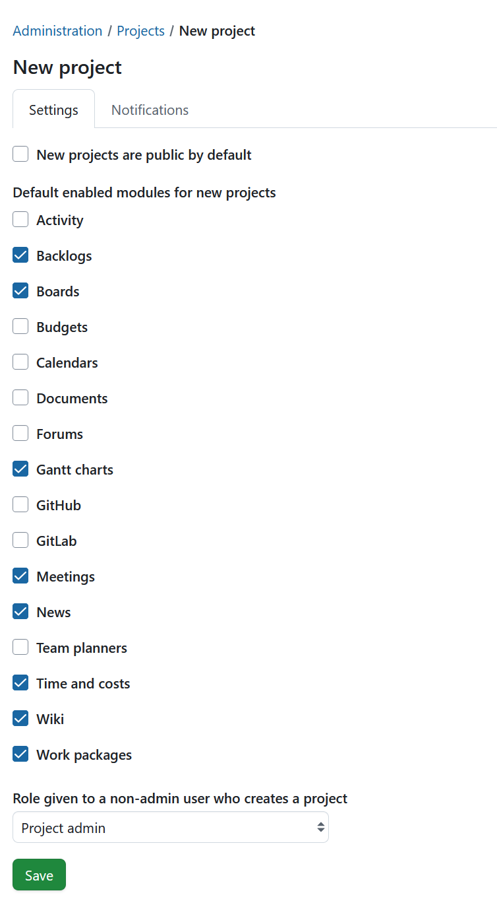
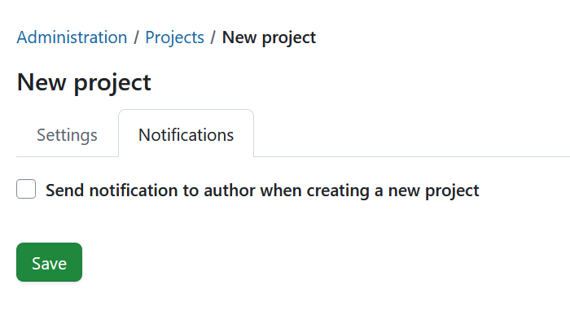

---
sidebar_navigation:
  title: New project
  priority: 200
description: Choose which modules are enabled by default for new projects and the role given to non-admin users who create a project
keywords: new project, settings, default, modules, project settings, project notifications, project template
---

# New project
The New project settings allow instance administrators to define default configuration values applied at project creation time. These settings allow you to configure:

- Default project visibility (public or private)
- Project modules enabled at creation time
- The initial project role assigned to non-admin project creators
- Notification behavior upon project creation

To configure defaults for newly created projects, navigate to *Administration settings → Projects → New project*.

> [!TIP] 
> Changes made on this page apply **globally** to the instance and affect only projects created after the settings are saved. Existing projects and their configurations remain unchanged.

## New project settings

The following options are available on the **New project** settings page:

- **New projects are public by default** 
  When enabled, newly created projects are marked as **public** by default. Public projects are visible to all users according to their global permissions. 
  - **Enabled**: Projects are created as public. 
  - **Disabled**: Projects are created as private and must be explicitly changed to public by a project administrator.
  
- **Default enabled modules for new projects** 
  Defines which project modules are activated automatically when a project is created. 
  - Selected modules are enabled by default for all new projects. 
  - Project administrators can modify module availability at any time from the project settings.
  
- **Role given to a non-admin user who creates a project** 
  Specifies the **project-level role** automatically assigned to a user who creates a project and is not an instance administrator. 
  - Default value: **Project admin** 
  - The assigned role defines the permissions granted to the creator immediately after project creation.

Once you have adjusted the settings, click **Save** to apply them across the instance.

## New project notifications

The **Notifications** tab controls whether a confirmation notification is sent to the project creator when a new project is created. When enabled, the project creator receives a notification confirming successful project creation.