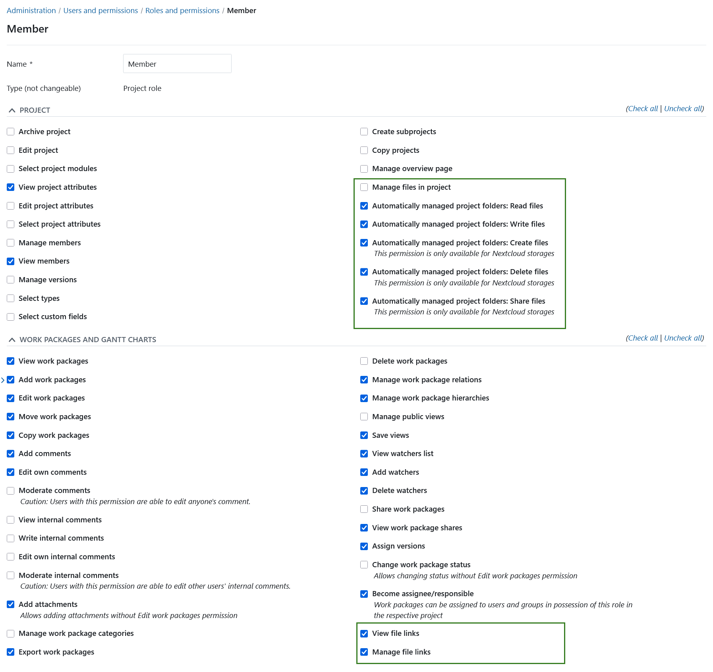

---
sidebar_navigation:
  title: Users and permissions FAQ
  priority: 001
description: Frequently asked questions regarding user, permissions, roles and groups
keywords: manage users FAQ, permissions, groups, roles, user settings
---

# Frequently asked questions (FAQ) for users and permissions

## I want to delete a user but it fails. What can I do?

If you are using the Enterprise cloud and the user you are trying to delete is the user that initially set up OpenProject, you will need to contact us to delete this user. For other users please make sure the box **User accounts deletable by admins** in **Administration -> Users and permissions -> Settings** is checked.

## We use LDAP. How do we release a license should someone leave our team and no longer need access?

There are two possibilities:

- You can block the user in the user list under **Administration**. The LDAP sync does not change the status and the user does not count into the active users anymore.
- The user can be released through an attribute in the LDAP or through an OpenProject LDAP group. Then the permission for this user can be removed in the LDAP and the user cannot use the LDAP authentication for OpenProject anymore. In this case the user still needs to be blocked or deleted in OpenProject.

## How can I assign the global role "project creator" to any newly created user (in LDAP) automatically?

There is no built in way to do that.

The best way of achieving the result is via the API v3 by [fetching users](../../../api/endpoints/users/#list-users) based on their creation date and for every newly created user, [assign the roles](../../../api/endpoints/memberships/#create-a-membership) that a new user should have.
Starting with OpenProject 11.2 this is also possible for global roles.

## What happens to a user's contributions (e.g. work packages) if I delete their account?

When a user is deleted his/her change history is preserved. All actions made by him/her are attributed to a user called **Deleted user**. E.g. a work package created by that user or a wiki page updated by him/her will remain unchanged. This means that you can continue to work with all work packages etc.. If you delete at least two users, you will no longer be able to identify which change was made by whom, as everything will be aggregated under the **Deleted user** user. Only information that is stored for the sake of the user alone, e.g. private queries or user preferences, will be deleted.

## Can I give users the ability to change work package status only?

It is possible to give users the ability to change status without that user having the rights to edit the rest of the work package. To do that you need to grant the **Change work package status** permission to the role this user is assigned.

### Can Administrators delegate the task to delete users?

No, only Administrators can delete other users.

### Can a user with "Edit users" global permission change administrators attributes?

No, only Administrators can update other Administrators attributes like name or email. This is to prevent the possibility of a user with "Edit users" global permission impersonating an Administrator by changing the email address to match theirs.

### Can I set a default role for a user that creates a new project?

You can set a [default role](../../projects/new-project) that users with this permission will have in a project they created.

### Users do not see the action *Create project* in the main navigation even though they have the create project permission?

This is UX bug tracked in [#50123](https://community.openproject.org/wp/50123).

### What is the difference between a project permission and a global permission?

Project permissions controls what a user can see and do within a project scope. Project permissions are attached to **project roles**. You can grant a user a permission in a specific project by giving the user one or more project roles in a specific project.

Examples for project permissions:

* Create work packages
* Add comments to a work package

Global permissions are system wide. They are attached to **global roles** and controls what a user can do and see independent of a specific project memberships.

### Can I convert a project role to a global role?

No this is not possible. You need to create a new role instead.

### What permissions exist for file storages?

Permissions related to the external file storages are part of the *Projects* and *Work packages and Gantt charts*:

Following are the permissions for file storages within OpenProject:

- **View file links**: Allows a user to see file links to external storages in the Files tab of work packages
- **Manage file links**: Allows a user to create and edit file links to work packages
- **Manage files in project**: Allows a user to add or edit file storages for a project

Following user permissions are set on files and folder in **External Storages**:

- **Automatically managed folders: Read files (Nextcloud, OneDrive)**

- **Automatically managed folders: Write files (Nextcloud, OneDrive)**

- **Automatically managed folders: Create files (Nextcloud)**

- **Automatically managed folders: Delete files (Nextcloud)**

- **Automatically managed folders: Share files (Nextcloud)**

  

> [!NOTE]
>
> Please note that not all file permissions are applicable to all storage providers.
