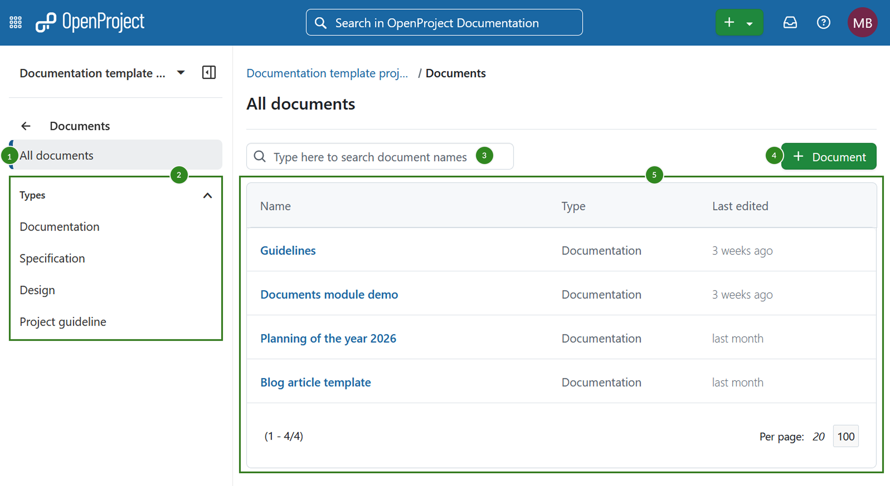
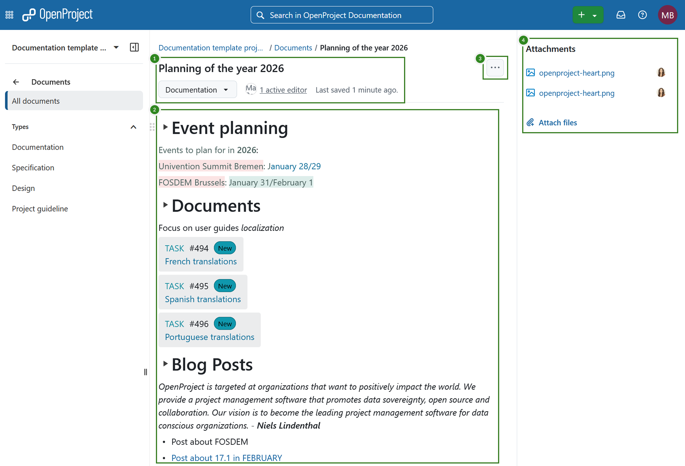
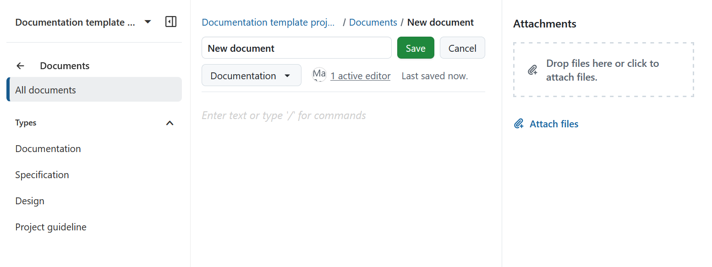
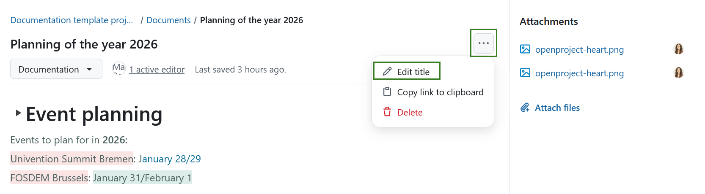
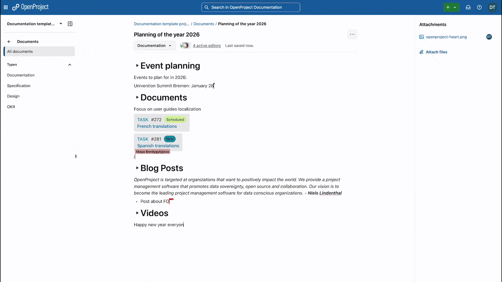
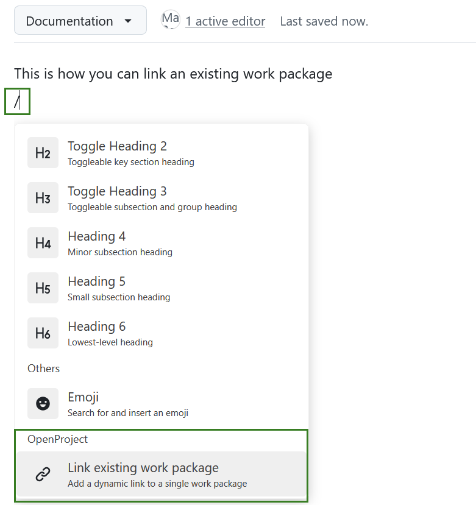
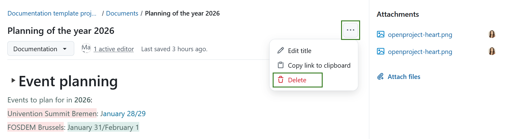

---
sidebar_navigation:
  title: Documents
  priority: 770
description: Create documents and attach files in OpenProject.
keywords: documents
---

# Documents

The Documents module allows you to write or upload documents directly to the project.

> [!NOTE]
> Use the Documents module to create, write, or upload documents directly in your projects. If you need to manage files stored externally, please take a look at the [file storages integrations](../file-management).

> [!IMPORTANT]
>
> With 17.0 release, real-time documents collaboration was introduced. It is automatically available for the following installation types: 
> - Containerized installations
> - Cloud-hosted installations
>
> **Packaged installations (DEB/RPM) require additional manual setup**. Please refer to the [system administration guide for more details](../../system-admin-guide/documents/#real-time-collaboration-in-documents). 

## Document index

To use the Documents module, make sure it is enabled in the Project settings of your project (Project settings → Modules). 

Once it is enabled, you can navigate to the *Documents* module in the sidebar of your project to get to the Documents index that lists all available documents:

The Documents index page lets you:

1. View all documents
2. Filter by document type
3. Quick-filter the list of documents based on the document title
4. Add a new document
5. View a list of all available documents, including their type and the date they were last edited

A document in OpenProject can be:

- a text written directly in the editor of a document
- a file uploaded and attached to a document
- both a file uploaded and attached to a document, with a text note that describes it

## View a document 

To view a document, simply click on the name of a document in the index. You will then see the document:

A document has:

1. A title, a category, number of active editors and last saved date
2. *More* menu with with options to edit, copy link and delete a document
3. The he document text itself
4. Attachments

## Add a new document to the project 

To create a new document, click on the *+ Document* button. 

In the form that appears, select the document category, give it a title and an optional description. You can optionally also attach a file to the document.

Please note that that these document categories are created by the administrator of your instance.

The uploaded documents are visible to all project members who have the necessary permissions.

> [!NOTE]
> There is no versioning of documents. An edit of any field or the contents of the document is visible to all members.

## Edit a project document 

You can edit a document anytime. 

To edit a document title, click on the *More (three dots)* menu and select *Edit title*. 

To edit the document itself simply click anywhere in the document and you can directly start editing. Simply start entering text or use **/** to add headings, blocks, media elements, emojis and link to work packages. 

e

### Collaborative editing

Multiple project members can edit a document at the same time. If they do, you will see what changes are made by which user in real time.

Take a look at this example for an illustration. 

### Link work packages to documents

You can link an existing work package to a document. To do that, start editing a document, type **/**, scroll down the list of available options and select *Link to existing work package*.

## Delete a project document

You can easily delete a document in OpenProject. 

To delete a document, click on the *More (three dots)* menu and select *Delete*. 

## Frequently asked questions (FAQ)

### Why can't I edit documents in real-time?

Real-time document collaboration is available in OpenProject starting with version 17.0, but whether you can use it depends on how your OpenProject instance is set up. In cloud-hosted and containerized setups, real-time editing is enabled by default. For packaged installations (DEB/RPM), additional configuration is necessary. Please contact your OpenProject administrator and/or refer to the [system administration guide for more details](../../system-admin-guide/documents/#real-time-collaboration-in-documents). 

### Is there a size limit for uploading documents to the OpenProject Enterprise cloud edition?

There is no limit in OpenProject in terms of the number of files that you can upload and work with in OpenProject. There is only a restriction in terms of the maximum file size: A file can have a size up to 256 MB.

