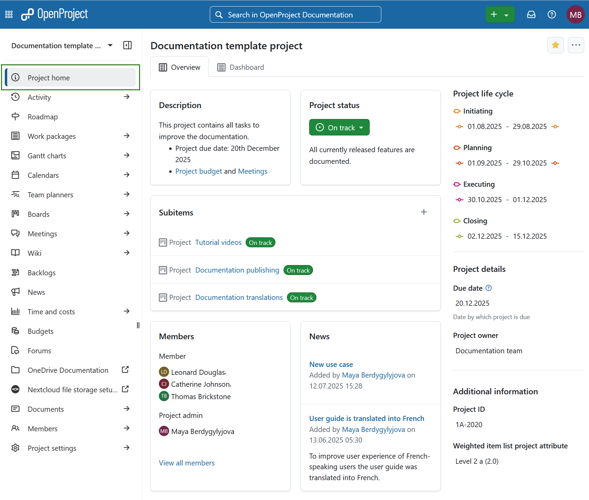
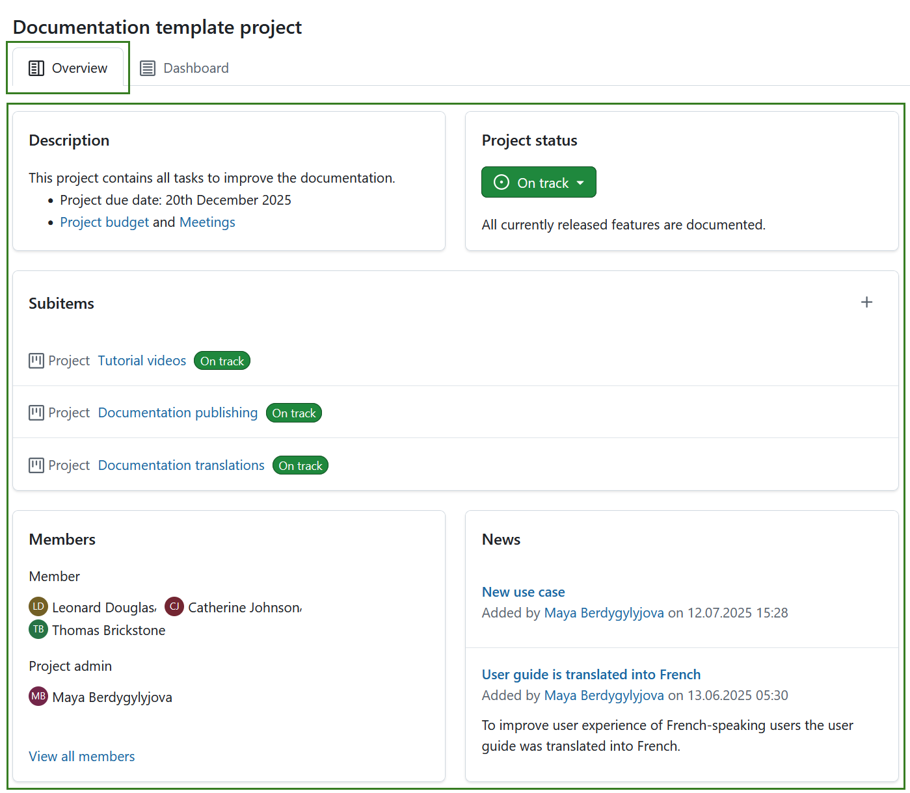
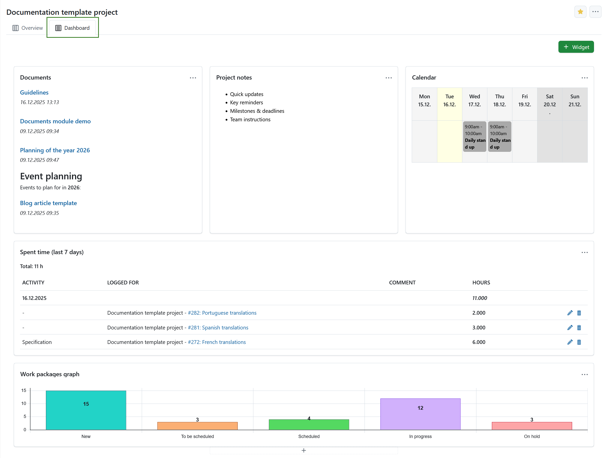
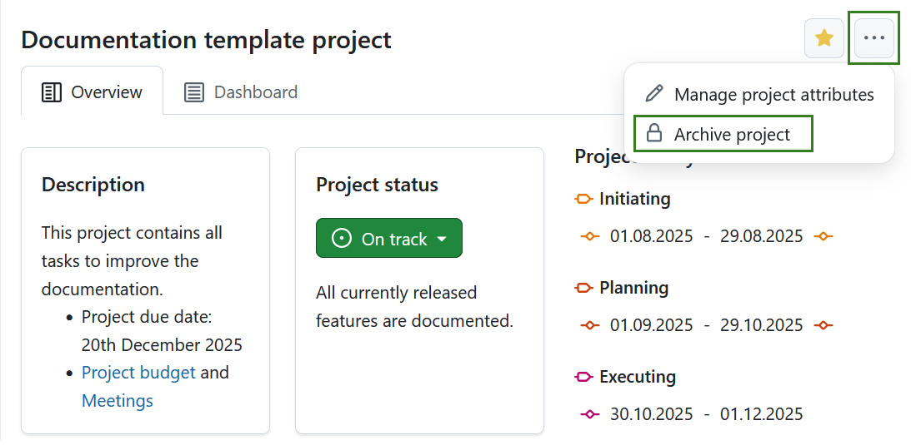

---
sidebar_navigation:
  title: Project home page
  priority: 900
description: Learn how to configure a project overview page
keywords: project overview page, project home page, project home, project overview, project dashboard, project life cycle, life cycle, lifecycle, project lifecycle, favorite, favourite, archive, project attribute
---

# Project home page

The **Project home page** page is a dashboard with important information about your respective project(s). This page displays all relevant information for your team, such as members, news, project description, work package reports, or project status. Information on the project overview is presented using [project attributes](./project-attributes/) and [widgets](./project-widgets/).  

| Topic                                                        | Content                                                      |
| ------------------------------------------------------------ | ------------------------------------------------------------ |
| [What is the project home page?](#what-is-the-project-home-page) | What can I do on the project home page?                      |
| [Project life cycle](project-life-cycle)                     | What is the project life cycle?                              |
| [Project attributes](project-attributes)                     | What are project attributes and how can I use them?          |
| [Mark project as a favorite](#mark-a-project-as-favorite)    | How can I mark a project as favorite?                        |
| [Archive a project](#archive-a-project)                      | How can I archive a project from the project home page?      |
| [Project widgets](project-widgets)                           | What are widgets, and how can I add them to my project home page? |

## What is the project home page?

The project home page is a centralized overview page that displays all essential information for a selected project. Its purpose is to serve as a single source of truth for the entire project team, providing quick access to key data and project progress.

You can access the project overview by navigating to **Project home** in the project menu on the left.

On the project overview page you will see the following sections: 

1. [**Overview** tab](#project-overview) is pre-configured set of [project widgets](project-widgets) to provide a concise summary of the project’s status. 
2. [**Dashboard** tab](#project-dashboard) provides access to all available widgets and allows full customization of layout and content according to user preferences. 
3. [Project life cycle](project-life-cycle)
4. [Project attributes](project-attributes)

Here you can also [mark a project as favorite](#mark-a-project-as-favorite) or [archive](#archive-a-project) it. 

## Project overview

The **Overview** tab is a pre-configured to provide a concise summary of the project’s status. Its layout is fixed and cannot be modified. It includes the following widgets: 

  - [Description](./project-widgets/#project-description-widget)

  - [Project status](./project-widgets/#project-status-widget) 

  - [Subitems](./project-widgets/#subitems-widget)  

  - [Members](./project-widgets/#members-widget) 

  - [News](project-widgets/#news-widget)  

  - Optional: [Project attributes](project-attributes). 
    
    >  [!TIP]
    >
    > Project attributes are usually displayed under the **project life cycle** section on the right, but a project attribute section can also be placed centrally under the pre-defined widgets. This placement can be changed under system administration.  

Learn more about [project widgets](project-widgets).

## Project dashboard

The **Dashboard** tab of the home page provides access to all available widgets and allows full customization of layout and content according to user preferences. Learn more about [project widgets](project-widgets).

> [!TIP]
>
> You can add same widgets to the project dashboard, as are also displayed on the project overview part of project home page. 

## Mark a project as favorite

You can mark the project as a *Favorite* by clicking the **Favorite** (star) icon in the upper right corner. The icon color will change to yellow and the project will be marked as favorite both on the project home page and in the projects list. Read more about [project lists](../projects/project-lists/). 

To remove a project from favorites click the **Favorite** icon again. 

## Archive a project

You can archive a project directly from the project home page. To do that click the **More** (three dots) icon and select *Archive project*.

> [!NOTE]
> This option is always available to instance and project administrators. It can also be activated for specific roles by enabling the *archive_project* permission for that role via the [Roles and permissions page](../../system-admin-guide/users-permissions/roles-permissions/) in the administrator settings.

You can also archive a project under [project settings](../projects/project-settings/project-information/#archive-a-project) or in a [projects list](../projects/project-lists/). 

