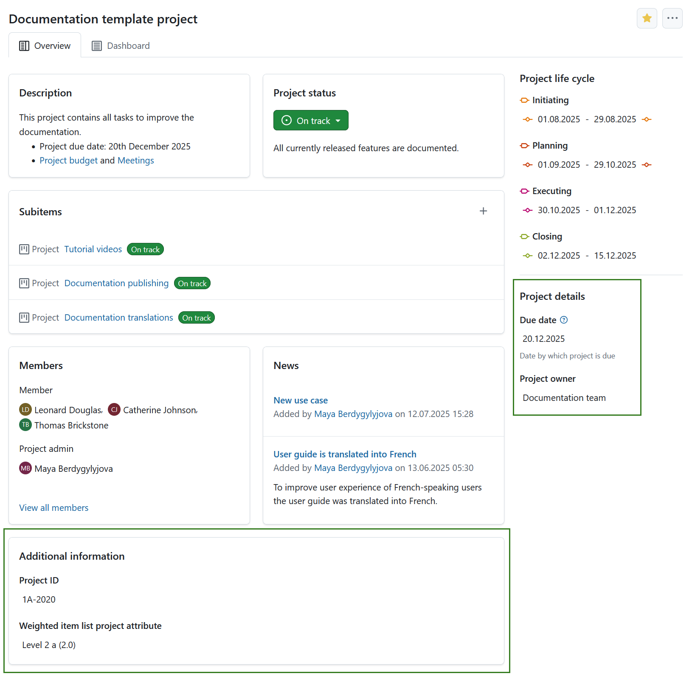
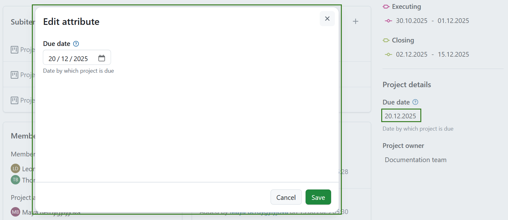

---
sidebar_navigation:
  title: Project attributes
  priority: 800
description: Learn how to configure project attributes
keywords: project attribute, attribute, project custom field, project overview, project information
---

# Project attributes

## Project attributes overview

**Project attributes** are a set of project-level custom fields that let you display certain types of information relevant to your project. Project attributes are displayed on the Overview (first) tab of the project home page.

Project attributes must first be created [on an instance level administration](../../../system-admin-guide/projects/project-attributes/) and then activated for a specific project under [project settings](../../projects/project-settings/project-attributes/).

The location of project attribute sections can be either in a pane on the right side under *project life cycle phases*, or in the main area under the project related widgets. The location of project attribute sections is determined under [project attribute settings in system administration](../../../system-admin-guide/projects/project-attributes/).

Project attributes are always grouped in sections.

> [!TIP]
> Your view of the project attributes may vary depending on your  [roles and permissions in OpenProject](../../../system-admin-guide/users-permissions/roles-permissions/). 
> The project attributes are visible for users with the **View project attributes** permission enabled. The editing icons are visible for users with the **Edit project attributes** permission.

To edit the value of any visible project attribute, simply click on that value. A modal will be displayed with all the attributes in that section.

Edit the values for each project attribute and click the **Save** button to confirm and save your changes.

> [!NOTE]
> If you are an instance administrator and would like to create, modify or add project attributes, please read our [system administration guide on project attributes](../../../system-admin-guide/projects/project-attributes).

## Project attribute settings 

To adjust the project attribute settings for a specific project click the **More** (three dots) icon and select *Manage project attributes*. This will lead you directly to the [project attribute settings](../../projects/project-settings/project-attributes/).

> [!NOTE]
> This option is always available to instance and project administrators. It can also be activated for specific roles by enabling the *select_project_attributes* permission for that role via the [Roles and permissions page](../../../system-admin-guide/users-permissions/roles-permissions/) in the administrator settings.