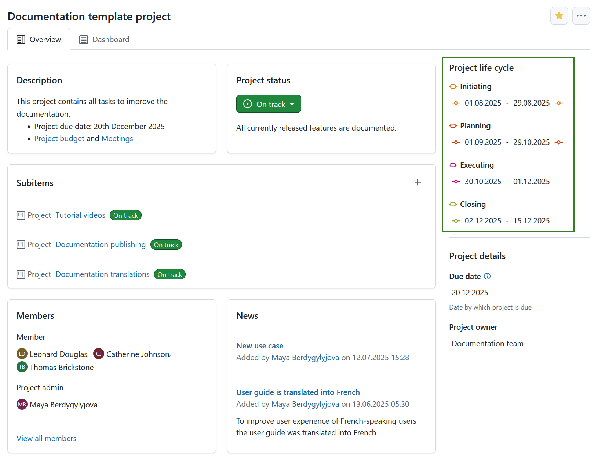
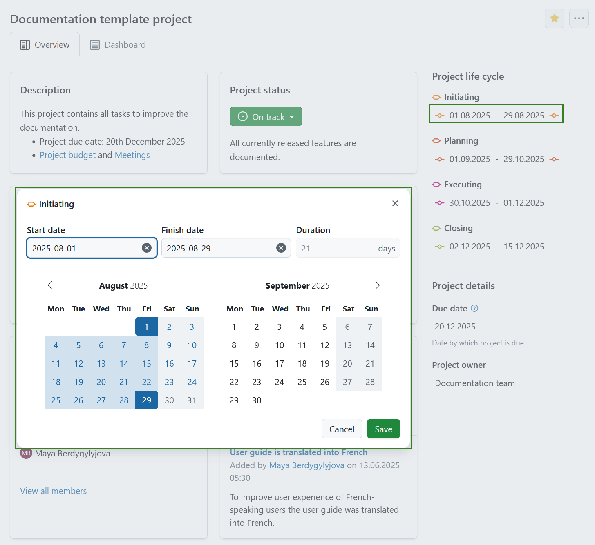

---
sidebar_navigation:
  title: Project life cycle
  priority: 700
description: Learn how to configure project life cycle
keywords: project life cycle, project home, life cycle, lifecycle, project phase, project timeline
---

# Project life cycle

## Project life cycle overview

**Project life cycle** is an overview of project phases and phase gates, which offers a clear view of where each project stands within its defined timeline. 

Project phases are managed in the system administration and can be enabled or disabled individually in the settings of each project. This allows for defining multiple life cycle variants within the system. For example, a detailed life cycle for complex projects and a simplified one for smaller or less structured projects.

On each project's **home page**, you can find a section called **project life cycle**. This section appears in the side panel above the **project attributes** and shows the dates configured for each phase and gate of the current project. 

> [!TIP]
>
> If all phases and gates are disabled for a project, the project lifecycle section is hidden from the home page.

## Schedule project phases

Project phases must follow specific rules for setting and adjusting dates. The system automatically schedules phases based on the input provided, enforcing correct order, preventing overlaps and gaps, and preserving durations where possible. Each subsequent phase starts on the next working day after the previous one ends."

For each of the active project phases, you can define a date range. To set or manage the date range click that date range (it will be empty initially) and set the date with an OpenProject date picker. 

> [!NOTE]
>
> Keep in mind that editing the date range of project phases requires the *Edit project phases* permission. 
> Viewing the project life cycle is also permission-controlled: without the *View project phases* permission, phases won't appear on the project home page, project list, work package filters, or on the work package view itself.

Use the guidelines below to understand how phase and gate scheduling behaves.

### Basic rules

- A phase is only considered fully defined when both a start and finish date are set. While it's possible to enter just one of the two (typically as a temporary state), such phases will not appear with dates in the overview. This allows flexibility when, for example, only the start date is known initially, but full definition is expected to follow shortly.
- The start date must be on or before the end date.
- The minimum duration of a phase is one day (start and end date can be the same).
- There is no maximum duration for a phase.
- Phases cannot overlap with one another.
- Gaps between phases and gates are not allowed.

### Phase gates and constraints

- Gates are always positioned at the start or end of a phase and follow the phase's dates.

  - You cannot set gate dates independently — adjusting the phase's start or finish date will automatically move the corresponding gate.

    - Phase gates are never placed inside the phase duration but always at its borders.
    - Phase gates never overlap or share the same date with other gates.

  - **Phases and phase gates will follow the order predefined in the system administration** (e.g., *Initiating* must come before *Closing*). Dates for a subsequent phase cannot be before those of any preceding phase. The automatic scheduling enforces this as well.

- Project phases not activated in a project will not be considered at all with regards to constraints. 
  - **Child projects** are **not restricted** by the lifecycle dates of their parent project.

### Automatic scheduling behavior

- **Scheduling occurs automatically** and without user confirmation when possible.
- When the **finish date of a phase changes**:
  - The **next active phase’s start date** is updated to the **next working day**. This can mean that the subsequent phase is moved into the future or into the past depending on the direction the preceding phase's finish date moved.
  - If the next phase has a **duration** (a phase will get a duration whenever start and finish date are set), its **finish date is adjusted** to preserve it (based on working days).
  - **Scheduling continues down the chain** of phases until no further adjustments are needed.

### Missing or partial dates

- Scheduling begins **as soon as enough dates are defined**, even if not all phases have dates.
- If a user **removes the finish date** of a phase, the **start date of the successor** phase is preserved to maintain its duration.

### Constraints and errors

- If a phase is shortened, subsequent phases are moved backwards in time.
- Setting a finish date that is **before the start date** results in an **error**. The start date is **not auto-adjusted**, and duration is not preserved in this case.

### Inactive phases

- **Inactive phases are ignored** during scheduling.
- The next **active** phase (based on the order defined in the administration) is treated as the logical successor.
- When a phase is **deactivated**, its dates remain unchanged, and the scheduling continues from the following active phase.

### Activating or deactivating phases

- When a phase is **activated**:
  - If the phase has a defined duration (both start and finish dates set), the system may adjust the dates to prevent gaps or overlaps.
  - This can trigger rescheduling of succeeding phases.
- When a phase is **deactivated**:
  - Its dates are preserved.
  - Scheduling will skip this phase and move directly to the next active phase.

> [!NOTE]
> Activating or deactivating phases requires the *Select project phases* permission.

### Other scheduling triggers

- **Changes to non-working days** (added or removed) will reschedule all affected phases across all projects to **preserve duration**.
- **Modifications in global phase configuration** (adding, deleting, reordering) do **not** immediately reschedule existing projects.
- However, the **first user interaction** with a lifecycle after such changes will trigger a rescheduling to preserve phase durations.
