---
sidebar_navigation:
  title: Project widgets
  priority: 900
description: Learn how to configure widgets on project home page
keywords: project overview, project home, home page, homepage, project widget
---

# Project widgets

## Project widgets overview

**Widgets** are small blocks of information that you can customize to display pertinent project information (such as project description, status, work package lists or graphs). These widgets are displayed on the project home page. 

> [!TIP]
>
> Project overview tab displays certain widgets in a pre-set layout. However, under the *Dashboard* tab you can add and remove multiple widgets, re-order them and resize them to your liking.

<video src="https://openproject-docs.s3.eu-central-1.amazonaws.com/videos/OpenProject-Quick_guide-Widgets.mp4"></video>

To add a widget to the project home page (Dashboard tab), click the green **+Widget** button. Alternatively, hover around the existing widgets and click the **+** icon that will appear automatically. 

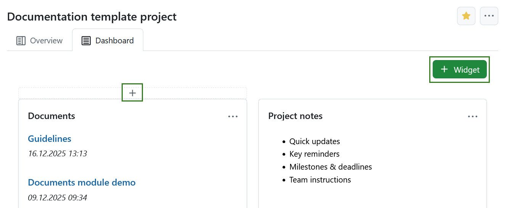

Click the **+** icon and choose which kind of widget you want to add.

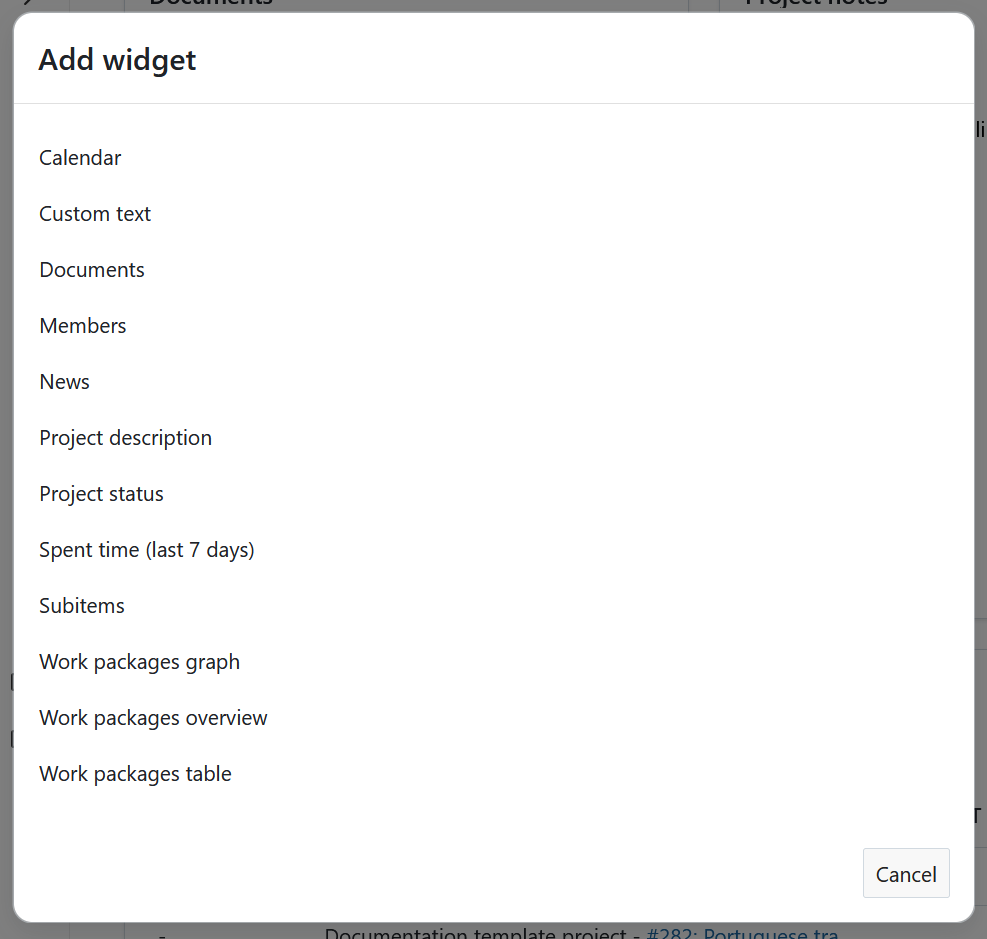

## Project widgets catalog

You can add various widgets to your project dashboard. Available widgets in OpenProject include:

- Calendar
- Custom text
- Documents
- Members
- News
- Project description
- Project status
- Spent time (last 7 days)
- Subitems
- Work packages graph
- Work packages overview
- Work packages table

### Calendar widget

The calendar widget displays your current work packages in a calendar. It shows work packages that are being worked on at the current date. The maximum number of displayable work packages is 100.

### Custom text widget

Within the custom text widget you can add any project information which you want to share with your team, e.g. links to important project resources or work packages, filters, specifications.

You can also add files to be displayed or attached to your custom text widget.

### Documents widget

This widget displays all documents created under the Documents module of your specific project.

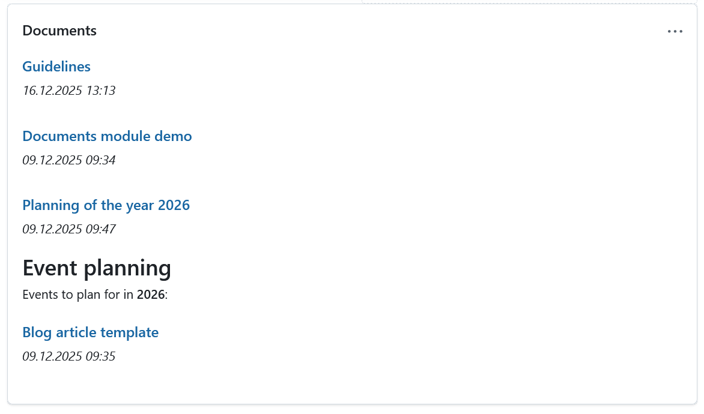

### Members widget

You can add a widget which displays all project members and their corresponding role for this project on the project home page. This includes both groups and users (placeholders or registered).

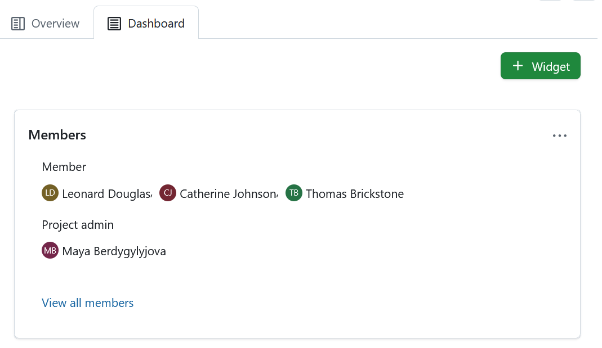

Clicking the **View all members** link will take you to the **[Members](../../members)** module, where you can view and edit the list of project members. Project members can be individuals as well as entire groups.

### News widget

Display the latest project news in the news widget on the project home page.

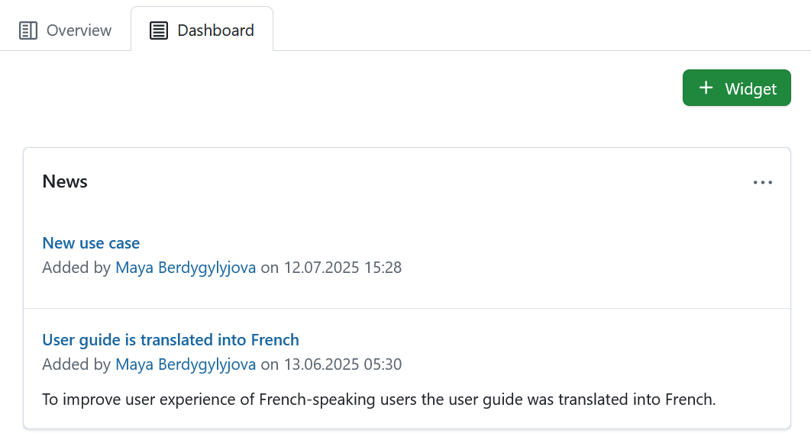

### Project description widget

The project description widget adds the project description to your project home.

The description can be added or changed in the [project settings](../../projects/project-settings).

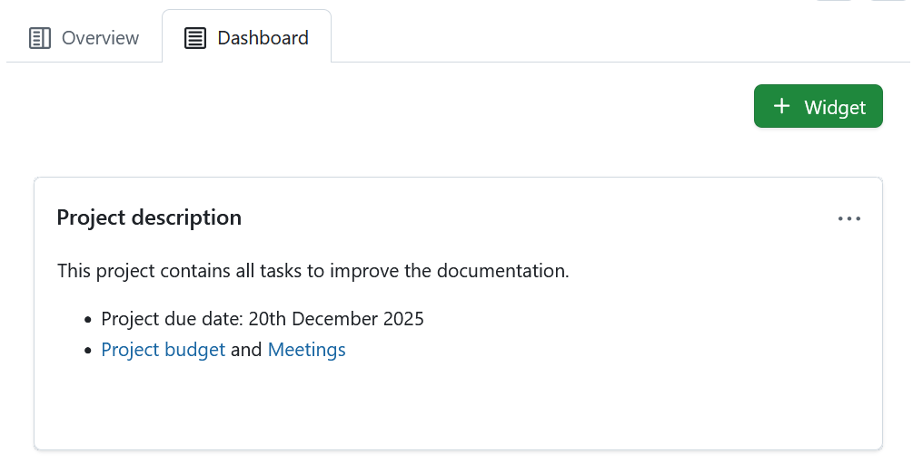

### Project status widget

Add your project status as a widget to display at a glance whether your project is on track, off track or at risk. You can set your project status and give a detailed description.

First, select your project status from the drop-down. You can choose between:

- On track
- Not set
- At risk
- Off track
- Not started
- Finished
- Discontinued

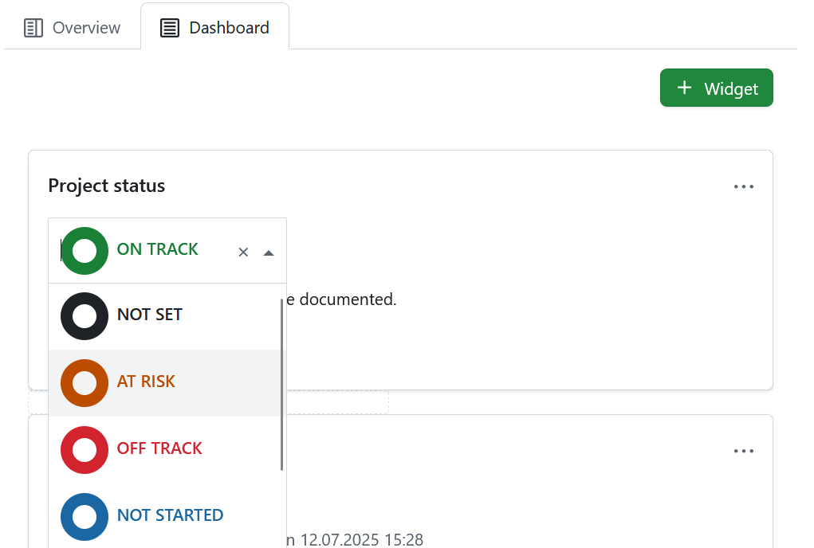

Add a **project status description** and further important information, such as project owner, milestones and other important links or status information.

### Spent time widget

The spent time widget lists the **spent time in this project for the last 7 days**.

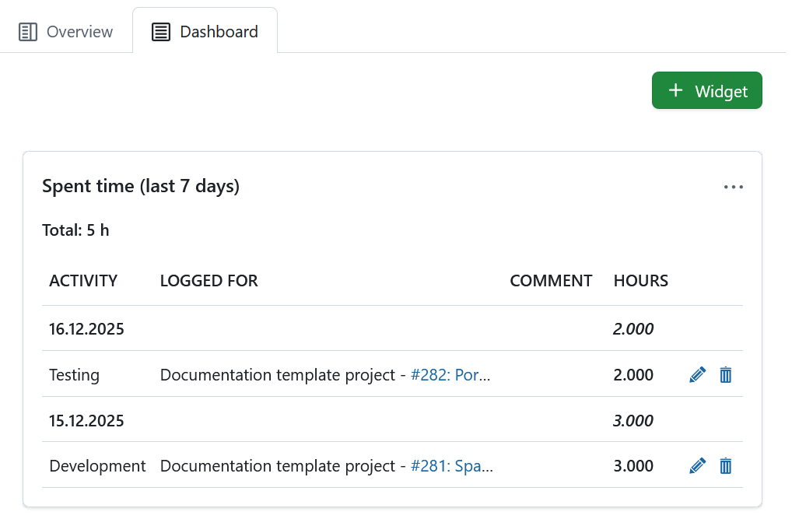

Time entries link to the respective work package and can be edited or deleted. To have a detailed view on all spent time and costs, go to the [Cost reporting](../../time-and-costs/reporting/) module.

### Subitems widget

The subitems widget lists all subitems of the respective entity:

- Subitems of a project are subprojects
- Subitems of a program are projects
- Subitems of a portfolio are programs are projects

The *Subitems* widget under the *Overview* tab allows adding subitems directly within the widget (click the **Plus** icon in the top right corner of the widget and select *Project*). That same widget under that *Dashboard* tab lists all subitems of a project, but offers no option to add subitems directly. 

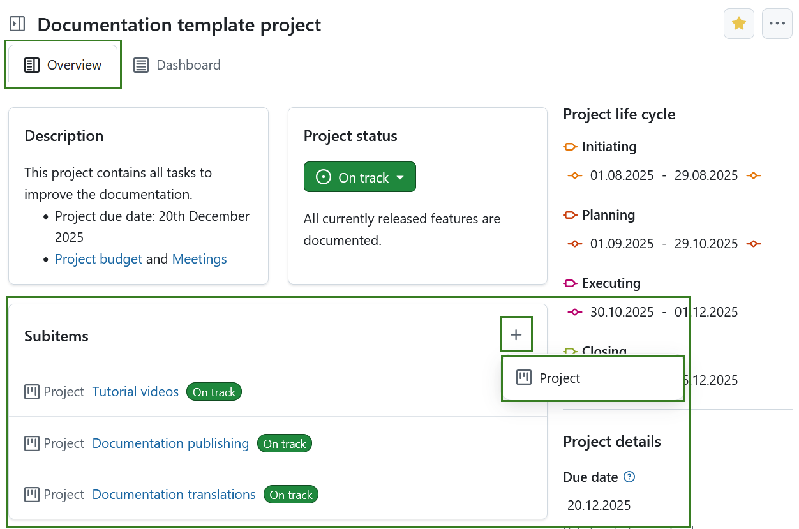

The widget only links the first subproject hierarchy and not the children of a subproject.

To edit the project hierarchy, go to the [project settings](../../projects/project-settings).

### Work package graph widgets

The work package graph widgets display information about the work packages within a project. They can be displayed in different graph views, such as a bar graph or a pie chart.

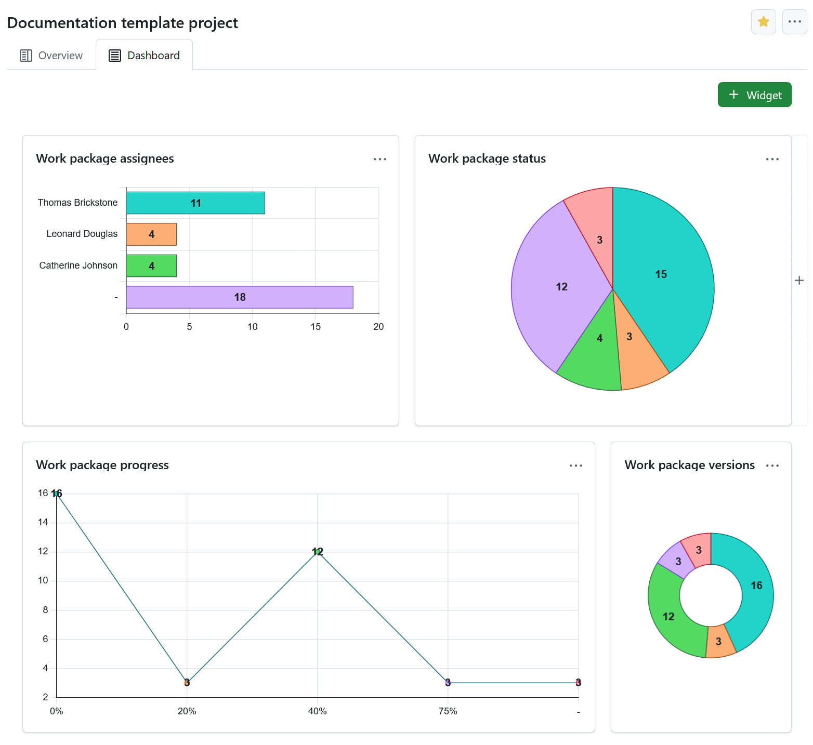

**Configure the work package graph**

You can filter the work packages to be displayed in the graph according to the [work packages table configuration](../../work-packages/work-package-table-configuration/).

To configure the work package graph, click the three dots icon in the top right corner and select **Configure view**.

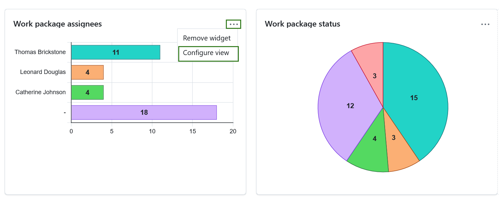

Select the **Axis criteria** to be displayed on the axis of the graph, e.g. Accountable, Priority, Status, Type.

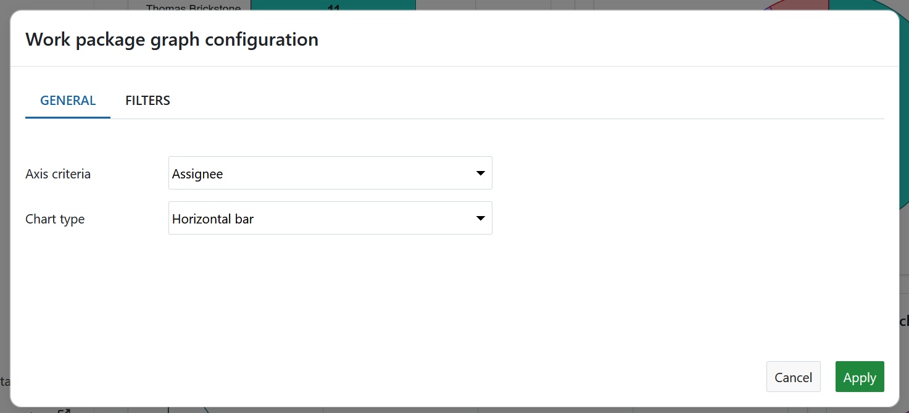

Next, select the **Chart type** how the work package information shall be displayed, e.g. as a bar graph, a line, a pie chart.

You can also filter the work packages for your chart. To do that, click the **Filters** tab in order to configure the work packages to be displayed, e.g. only work packages with the priority "high".

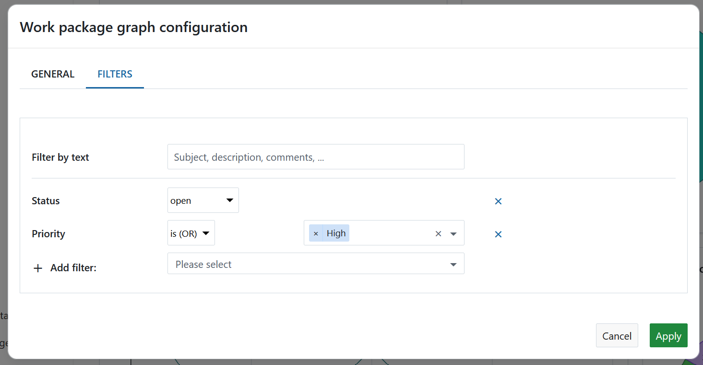

Click the **Apply** button to save your changes.

### Work packages overview widget

The work packages overview widget displays all work packages in a project differentiated by a certain criteria.

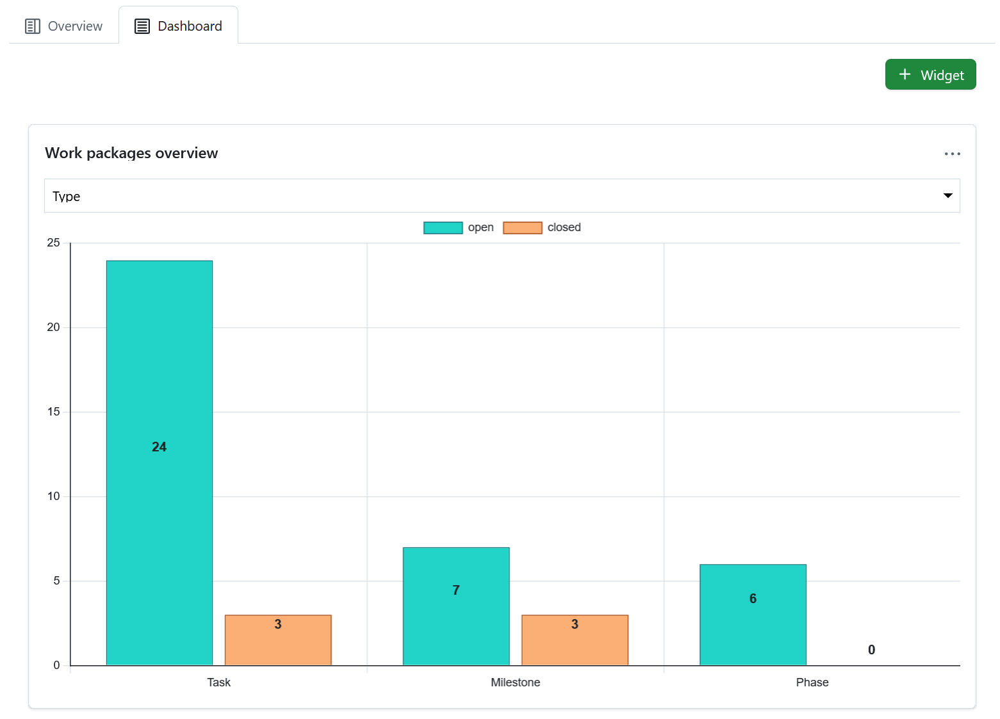

You can display the graph according to the following criteria:

* Category
* Type
* Status
* Priority
* Author
* Assignee

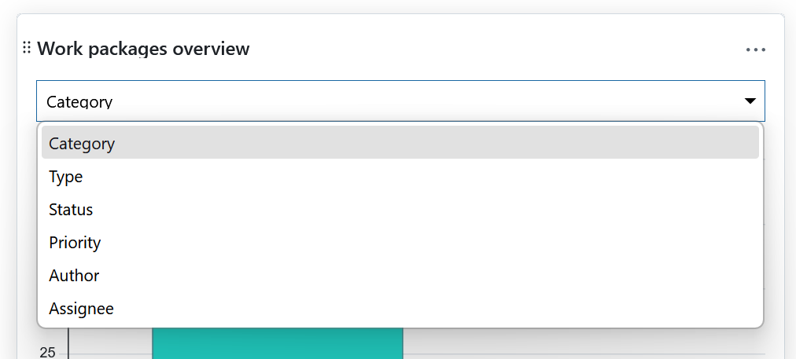

The widget lists all **open** and all **closed** work packages according to this criteria.

### Work package table widget

The work package table widget includes a work package table to the project home. The work package table can be filtered, grouped, or sorted according to the [work package table configuration](../../work-packages/work-package-table-configuration/), e.g. to display only work packages with the priority "High".

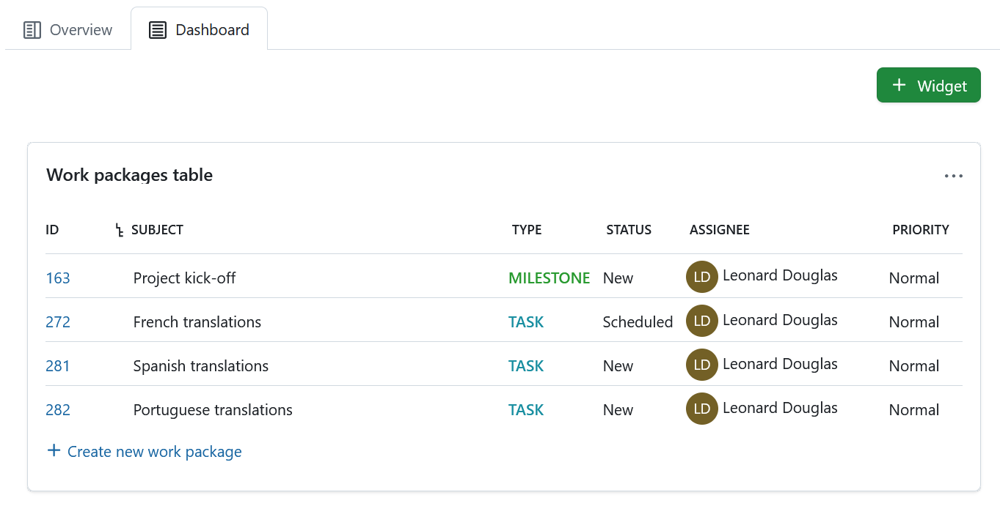

## Resize and reorder widgets

To **reorder** a widget, click the dots icon on the upper left hand corner and drag the widget with the mouse to the new position.

To **resize** a widget, click the grey icon in the lower right hand corner of the widget and drag the corner to the right or left. The widget will resize accordingly.

## Remove widgets from project home page

To remove a widget from the project home page, click the three dots icon at the top right corner of the widget and select **Remove widget**.
> [!NOTE]
> Please keep in mind that this is only possible under the *Dashboard* tab. Project widgets under the *Overview* tab are fixed and can not be removed.

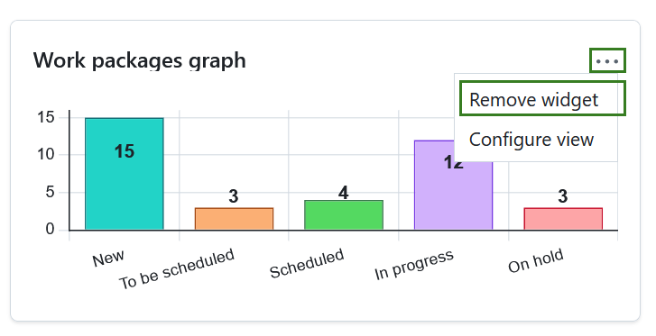
