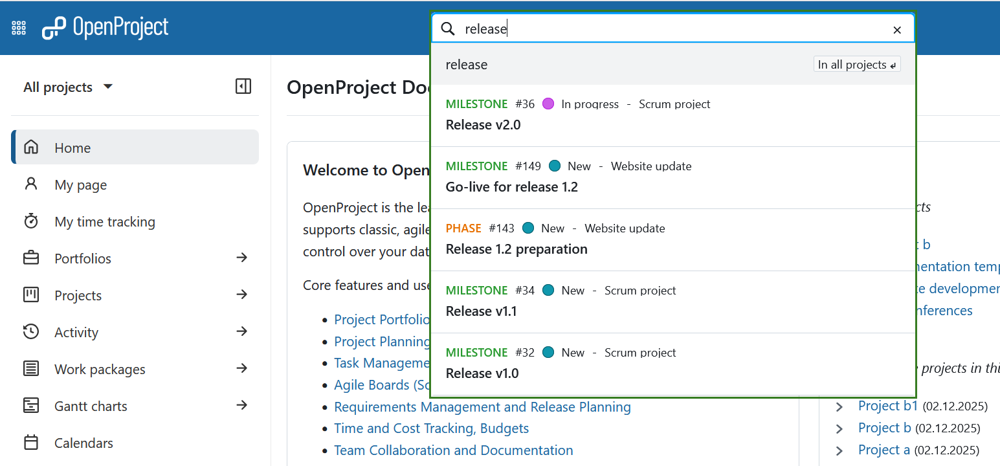
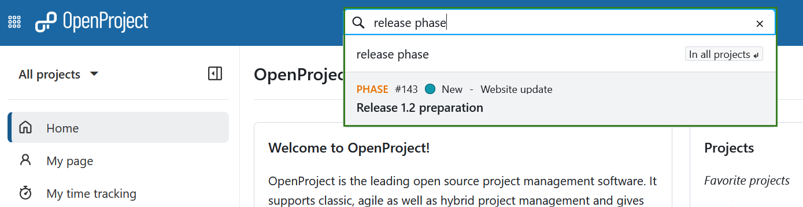
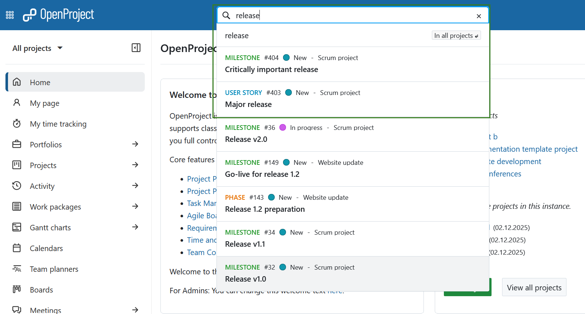
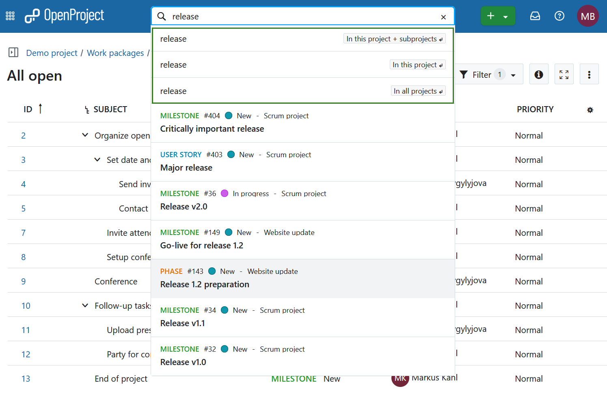
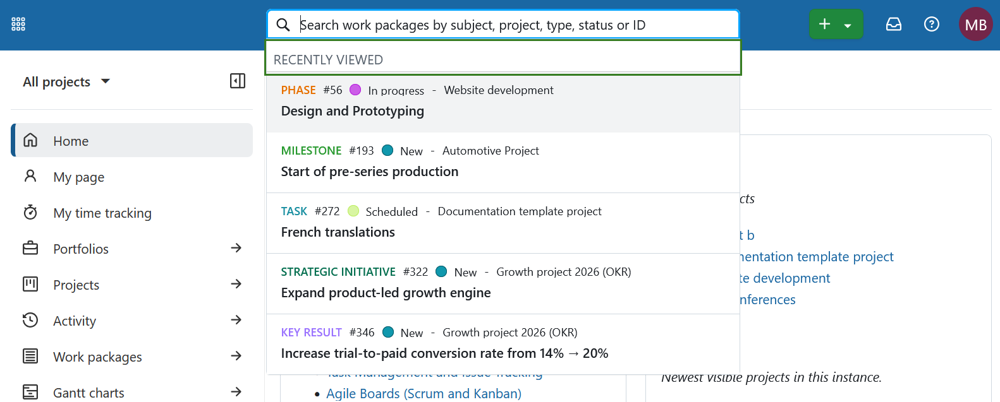

---
sidebar_navigation:
  title: Search
  priority: 000
description: How to use the search bar and search feature in OpenProject
keywords: search, find, filter, search bar, text search, fulltext search, full-text
---

# Search features

There are two ways to search for work packages, documents, projects, etc. in OpenProject: The search bar and the advanced search.

## Search bar

The search bar is located in the **center of the header navigation**. To find work packages by subject, start typing your search terms — **do not press Enter**. An auto-completer will suggest matching work packages from all projects you have access to. You can click a suggestion or right-click to open it in a new tab.

You can also search by work package type, status, ID, or the project it belongs to. For example, let's start by searching for a keyword within a subject: entering the word **“release”** will show all work packages with the word “release” in the subject.

Adding a type, such as **“phase”** (e.g., **“phase release”** or **“release phase”**), narrows results to work packages of that type containing the term.

You can also filter by status, for example **“release in progress”**, which returns work packages currently in progress that contain “release” in the subject.

> [!TIP]
> Searching for **“release”** will also return work packages whose subject contains the term as part of a longer phrase, such as **“major release.”**

## Advanced search

To access the more detailed, advanced search, choose one of the options shown below the search bar with your arrow keys (then press the Enter key) or by using the mouse. If you do not have a project open at the moment (i.e. are on the global level), the first two options won't be shown.

You can now view search results from different categories or sections of OpenProject. In the work packages section you can click on **Advanced filter** to access additional filter options. This allows using the same search criteria as in the work package tables.

> [!NOTE]
>
> It is not possible to find content from archived projects. You will have to un-archive them first on the [global projects overview page](../projects/project-lists/).

## Full-text search

The OpenProject search bar is configured for full-text search. This means you can search not only headings but also content such as wiki pages or work package descriptions and attachments.

The title and the description of a work package can also be found by [filtering by text](../work-packages/work-package-table-configuration/#filter-by-text).
Aside from full-text search, you can [search work packages based on their attached file name or even within the content of an attachment](../work-packages/work-package-table-configuration/#filter-for-attachment-file-name-and-content).

## Recently viewed work packages

Clicking the search bar immediately shows your most recently viewed work packages, even before you start typing.

