---
sidebar_navigation:
  title: Create work packages
  priority: 990
description: How to create work packages in OpenProject.
keywords: create work package, new work package, add work package
---

# Create Work packages

| Topic                                                                  | Content                                        |
|------------------------------------------------------------------------|------------------------------------------------|
| [Create Work packages](#create-work-packages)                          | How to create a new Work package in a project. |
| [Add attachments to a Work package](#add-attachments-to-work-packages) | How to add attachments to a Work package.      |

## Create Work packages

There are several ways to create work packages in OpenProject:

- [Through the header navigation](#create-a-work-package-via-header-navigation) from anywhere within the application
- [In-line in the Work package table](#create-a-work-package-in-the-table-view) to quickly create multiple Work packages
- [In a split screen view](#create-a-work-package-in-the-split-screen-view) which allows you to specify detailed information from the start

### Create a Work package via header navigation

You can create a work package from anywhere within the application by clicking the green **+** button in the header navigation and directly selecting a work package type.

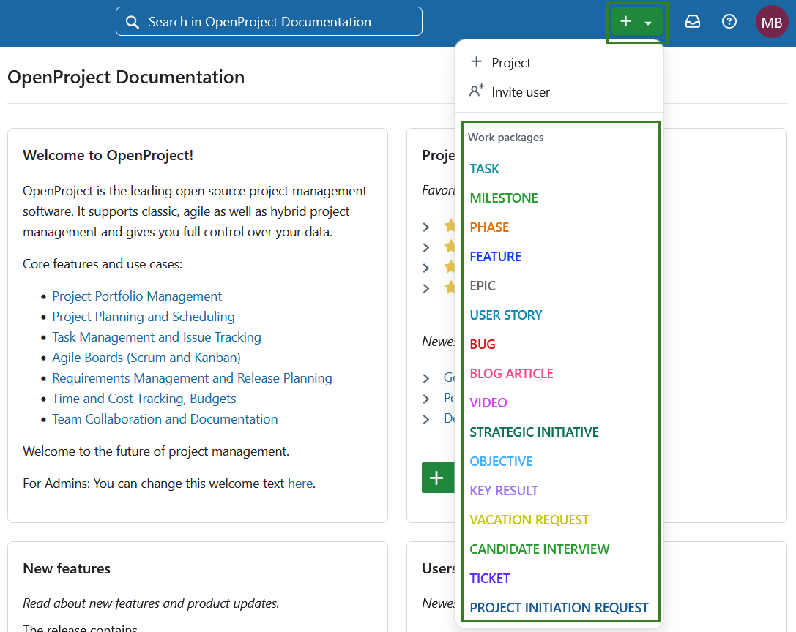

A form will open, where you can specify the project, name, description, priority, dates, etc. Depending on a work package type selected, the form may include additional fields to fill out. 

> [!TIP]
>
> If you have not yet selected the project, *Assignee* and *Accountable* will show no selectable values. Once you select a project, members of the selected project will be selectable. 

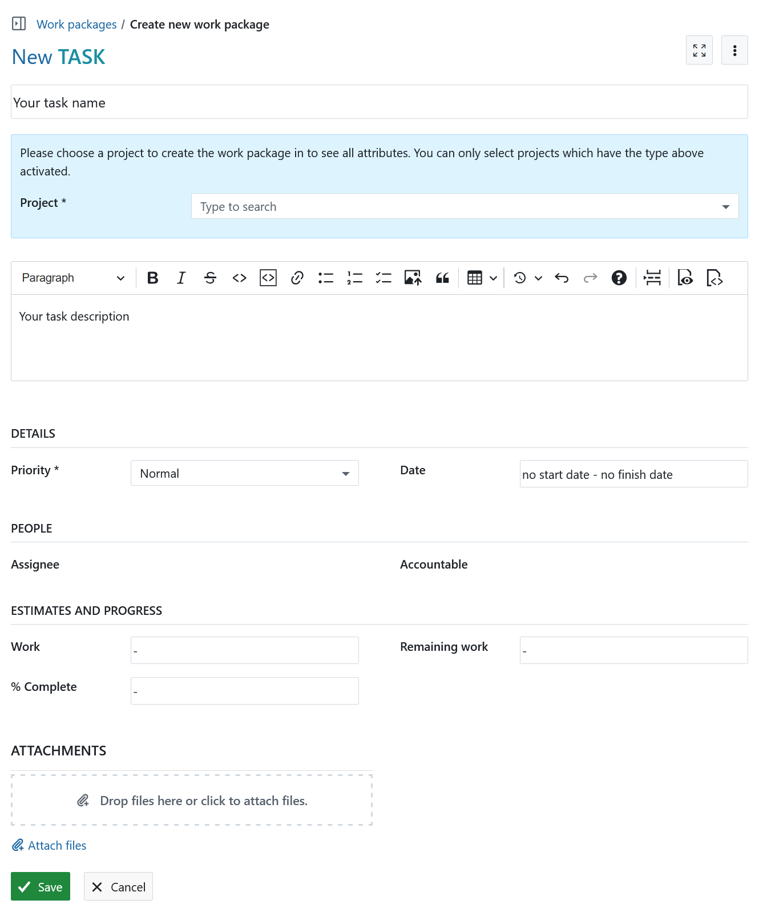

### Create a Work package in work packages module

You can also create a work package directly from within the work package module (either within a specific project, or from the global module level). 

[Select a project](../../../getting-started/projects/#open-an-existing-project) and navigate to the Work package module in the project module menu on the left. Alternatively select the global Work packages module.

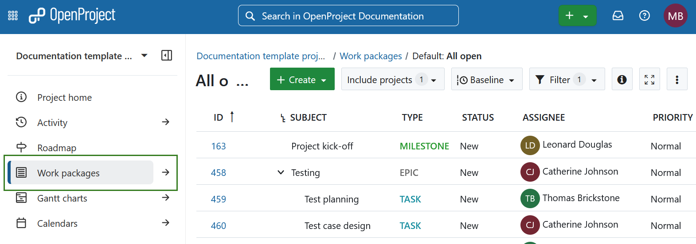

Click the **+ Create** button above the work packages table and select the type of work package you want to create. 

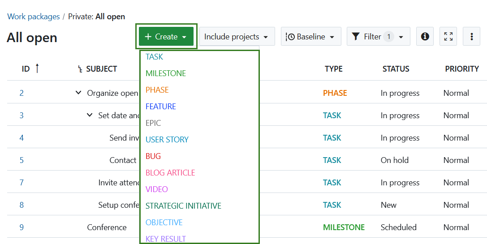

### Create a Work package in the table view

To create new Work packages directly inline in the table view, click on the **+ Create new Work package** link below the table.

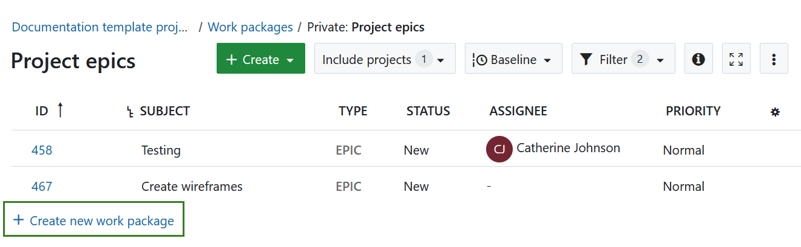

The new Work package appears in a highlighted row in the table. Type in the subject of the Work package, change attributes, such as Type or Status directly in the table and hit Enter to save the changes.

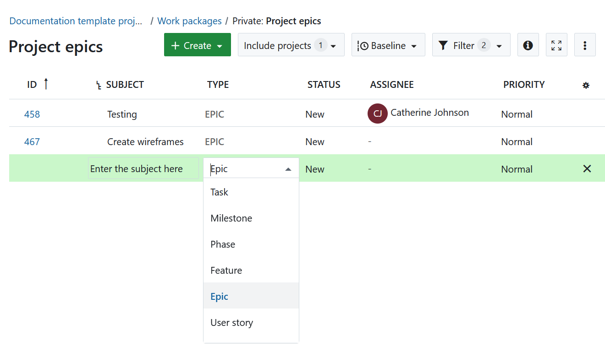

This way, you can quickly and easily create new Work packages in the table.

### Create a Work package in the split screen view

In order to enter detailed information into the Work package from the start, you can create a Work package in the split screen view. In the Work package module, click the green **+ Create** button and select the type of Work package you want to create.

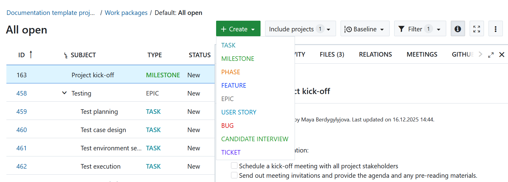

The new Work package form will open in the split screen view. Enter all information, such as Description, Assignee, Status, Priority, Due date and more.

Click the **Save** button.

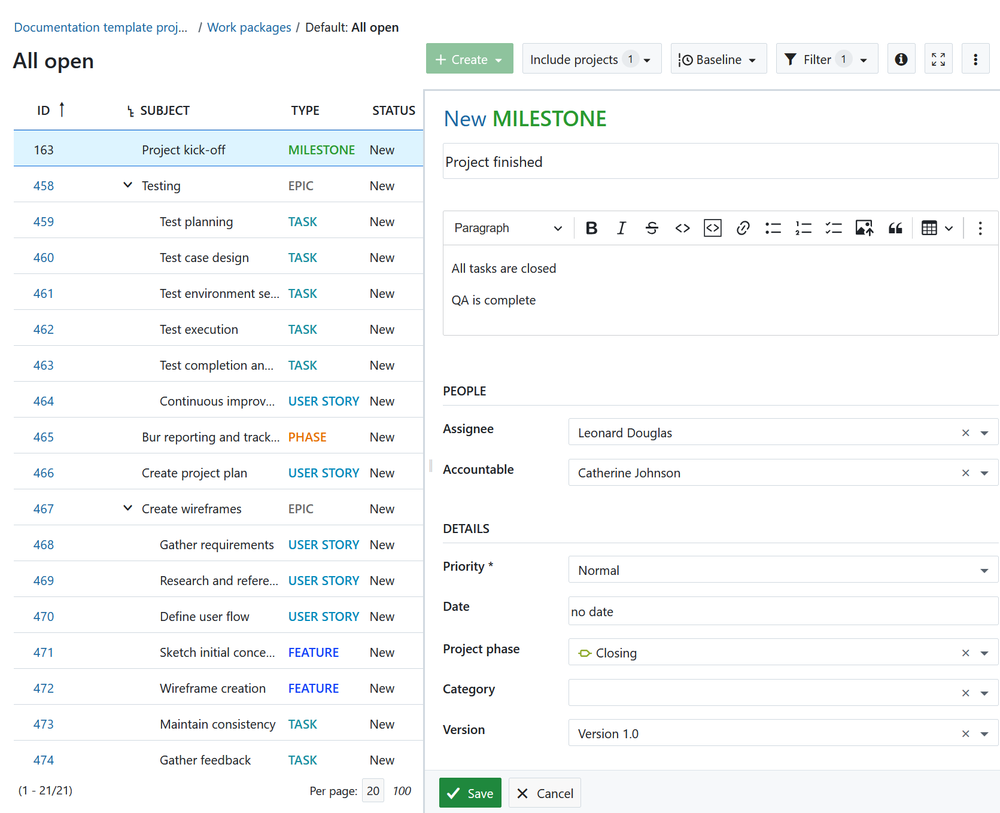

## Add emojis to Work packages 

You can add emojis to all text editors, including the Work package description. Type a colon and a letter, e.g. **:a** into the text editor and get a suggested list of emojis you can use.

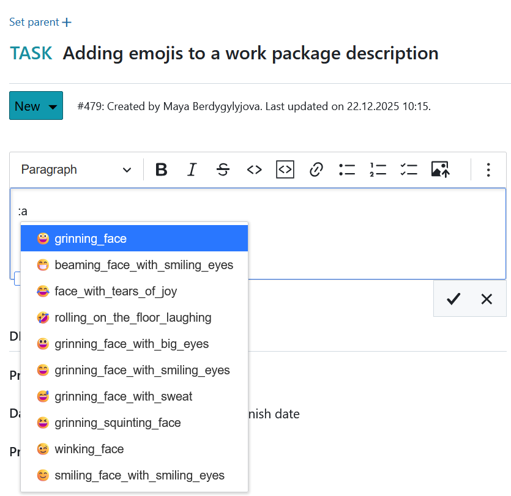

To find out **how to create a child Work package**, please click [here](../work-package-relations-hierarchies/#add-a-child-work-package).

## Add attachments to Work packages

You can directly add images, e.g. via copy and paste to the **Work package description**. You can also use the toolbar above the Work package description and click the Insert image icon:

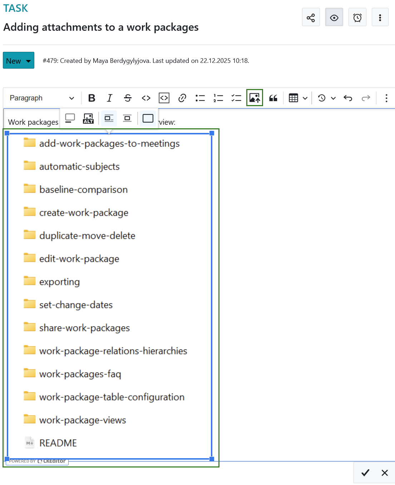

At the bottom of the Work package form you can add files via drag and drop or select a file from a folder to upload it to the Work package.

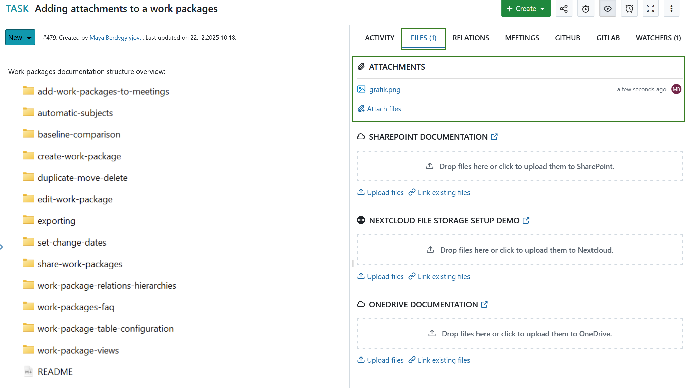

> [!TIP]
> It is also possible for users that are not members of the project to add attachments to work packages if they have been granted permission by an administrator. This can be useful, for example, for confirming bug reports.

Find out how to [edit existing Work packages](../edit-work-package).

> [!NOTE]
> You can also use [Nextcloud](../../file-management/nextcloud-integration/#link-files-and-folders-to-work-packages), [OneDrive](../../file-management/one-drive-integration/#link-files-and-folders-to-work-packages) or [SharePoint](../../file-management/sharepoint-integration/) integrations to upload files to a file storage or link already existing files or folders to a work package under the tab **Files**.
